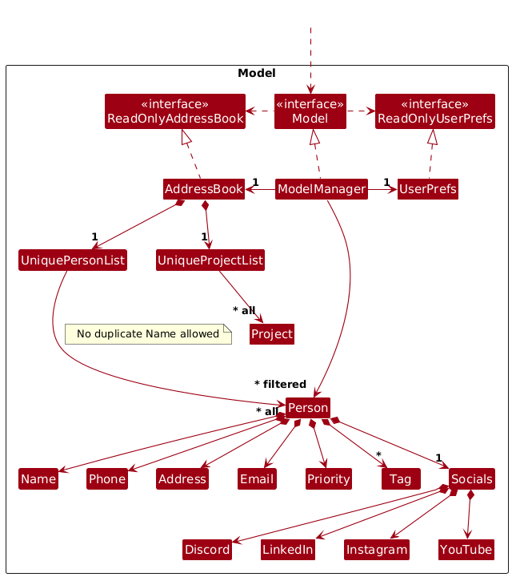
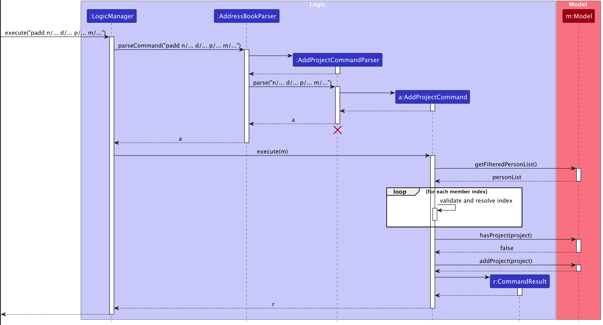
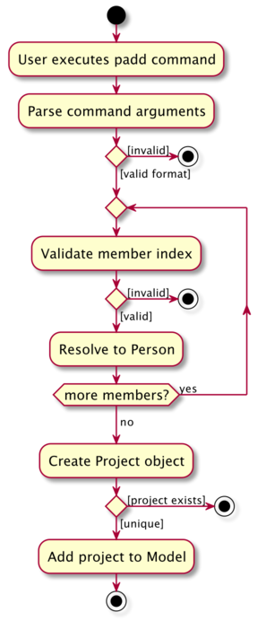
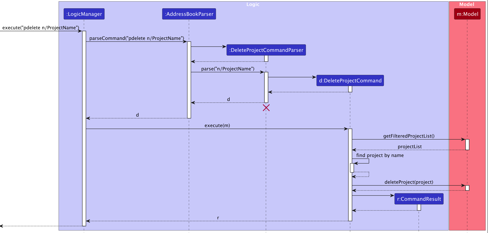
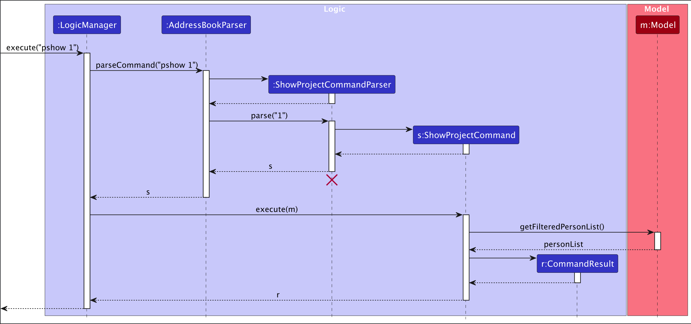
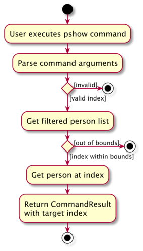

* Table of Contents
- [Acknowledgements](#acknowledgements)
- [Setting up, getting started](#setting-up-getting-started)
- [Design](#design)
    - [Architecture](#architecture)
    - [UI component](#ui-component)
    - [Logic component](#logic-component)
    - [Model component](#model-component)
    - [Storage component](#storage-component)
    - [Common classes](#common-classes)
- [Implementation](#implementation)
    - [Project Management Features](#project-management-features)
        - [Add Project Feature](#add-project-feature)
        - [Delete Project Feature](#delete-project-feature)
        - [Show Project Feature](#show-project-feature)
    - [\[Proposed\] Undo/redo feature](#proposed-undoredo-feature)
        - [Proposed Implementation](#proposed-implementation)
        - [Design considerations:](#design-considerations)
    - [\[Proposed\] Data archiving](#proposed-data-archiving)
- [Documentation, logging, testing, configuration, dev-ops](#documentation-logging-testing-configuration-dev-ops)
- [Appendix: Requirements](#appendix-requirements)
    - [Product scope](#product-scope)
    - [User stories](#user-stories)
    - [Use cases](#use-cases)
    - [Non-Functional Requirements](#non-functional-requirements)
    - [Glossary](#glossary)
- [Appendix: Instructions for manual testing](#appendix-instructions-for-manual-testing)
    - [1. Launch, shutdown & window preferences](#1-launch-shutdown--window-preferences)
    - [2. Quick seed data (contacts)](#2-quick-seed-data-contacts)
    - [3. add, edit, find, tag, sort (contacts)](#3-add-edit-find-tag-sort-contacts)
    - [4. delete (contacts)](#4-delete-contacts)
    - [5. Create projects with padd](#5-create-projects-with-padd)
    - [6. View projects: pshow & pdetails](#6-view-projects-pshow--pdetails)
    - [7. Join & Leave projects: join, leave (+ safety)](#7-join--leave-projects-join-leave--safety)
    - [8. Edit projects: pedit](#8-edit-projects-pedit)
    - [9. Delete projects: pdelete](#9-delete-projects-pdelete)
    - [10. Deadlines view: deadline](#10-deadlines-view-deadline)
    - [11. Data saving & file edits](#11-data-saving--file-edits)
    - [12. Help & known-issues checks](#12-help--known-issues-checks)
    - [13. Clear & Exit](#13-clear--exit)
    - [Suggested end-to-end path (copy-paste block)](#suggested-end-to-end-path-copy-paste-block)
    - [Notes on edge cases for exploratory testing](#notes-on-edge-cases-for-exploratory-testing)
- [Appendix: Planned Enhancements](#appendix-planned-enhancements)


--------------------------------------------------------------------------------------------------------------------

## **Acknowledgements**

* Libraries used: [Checkstyle](https://github.com/checkstyle/checkstyle), [Jackson](https://github.com/FasterXML/jackson), [JavaFX](https://openjfx.io/), [JUnit](https://github.com/junit-team/junit5), [Shadow](https://github.com/GradleUp/shadow)
* References used: [SE-EDU initiative](https://se-education.org/), [AB3](https://github.com/se-edu/addressbook-level3)

--------------------------------------------------------------------------------------------------------------------

## **Setting up, getting started**

Refer to the guide [_Setting up and getting started_](SettingUp.md).

--------------------------------------------------------------------------------------------------------------------

## **Design**

<div markdown="span" class="alert alert-primary">

:bulb: **Tip:** The `.puml` files used to create diagrams are in this document `docs/diagrams` folder. Refer to the [_PlantUML Tutorial_ at se-edu/guides](https://se-education.org/guides/tutorials/plantUml.html) to learn how to create and edit diagrams.
</div>

### Architecture


The ***Architecture Diagram*** given above explains the high-level design of the App.

Given below is a quick overview of main components and how they interact with each other.

**Main components of the architecture**

**`Main`** (consisting of classes [`Main`](https://github.com/AY2526S1-CS2103T-W11-3/tp/tree/master/src/main/java/seedu/address/Main.java) and [`MainApp`](https://github.com/AY2526S1-CS2103T-W11-3/tp/tree/master/src/main/java/seedu/address/MainApp.java)) is in charge of the app launch and shut down.
* At app launch, it initializes the other components in the correct sequence, and connects them up with each other.
* At shut down, it shuts down the other components and invokes cleanup methods where necessary.

The bulk of the app's work is done by the following four components:

* [**`UI`**](#ui-component): The UI of the App.
* [**`Logic`**](#logic-component): The command executor.
* [**`Model`**](#model-component): Holds the data of the App in memory.
* [**`Storage`**](#storage-component): Reads data from, and writes data to, the hard disk.

[**`Commons`**](#common-classes) represents a collection of classes used by multiple other components.

**How the architecture components interact with each other**

The *Sequence Diagram* below shows how the components interact with each other for the scenario where the user issues the command `delete 1`.


Each of the four main components (also shown in the diagram above),

* defines its *API* in an `interface` with the same name as the Component.
* implements its functionality using a concrete `{Component Name}Manager` class (which follows the corresponding API `interface` mentioned in the previous point.

For example, the `Logic` component defines its API in the `Logic.java` interface and implements its functionality using the `LogicManager.java` class which follows the `Logic` interface. Other components interact with a given component through its interface rather than the concrete class (reason: to prevent outside component's being coupled to the implementation of a component), as illustrated in the (partial) class diagram below.


The sections below give more details of each component.

### UI component

The **API** of this component is specified in [`Ui.java`](https://github.com/AY2526S1-CS2103T-W11-3/tp/tree/master/src/main/java/seedu/address/ui/Ui.java)


The UI consists of a `MainWindow` that is made up of parts e.g.`CommandBox`, `ResultDisplay`, `PersonListPanel`, `StatusBarFooter` etc. All these, including the `MainWindow`, inherit from the abstract `UiPart` class which captures the commonalities between classes that represent parts of the visible GUI.

The `UI` component uses the JavaFx UI framework. The layout of these UI parts are defined in matching `.fxml` files that are in the `src/main/resources/view` folder. For example, the layout of the [`MainWindow`](https://github.com/AY2526S1-CS2103T-W11-3/tp/tree/master/src/main/java/seedu/address/ui/MainWindow.java) is specified in [`MainWindow.fxml`](https://github.com/AY2526S1-CS2103T-W11-3/tp/tree/master/src/main/resources/view/MainWindow.fxml).

The `UI` component,

* executes user commands using the `Logic` component.
* listens for changes to `Model` data so that the UI can be updated with the modified data.
* keeps a reference to the `Logic` component, because the `UI` relies on the `Logic` to execute commands.
* depends on some classes in the `Model` component, as it displays `Person` object residing in the `Model`.

### Logic component

**API** : [`Logic.java`](https://github.com/AY2526S1-CS2103T-W11-3/tp/tree/master/src/main/java/seedu/address/logic/Logic.java)

Here's a (partial) class diagram of the `Logic` component:


The sequence diagram below illustrates the interactions within the `Logic` component, taking `execute("delete 1")` API call as an example.


<div markdown="span" class="alert alert-info">:information_source: **Note:** The lifeline for `DeleteCommandParser` should end at the destroy marker (X) but due to a limitation of PlantUML, the lifeline continues till the end of diagram.
</div>

How the `Logic` component works:

1. When `Logic` is called upon to execute a command, it is passed to an `AddressBookParser` object which in turn creates a parser that matches the command (e.g., `DeleteCommandParser`) and uses it to parse the command.
1. This results in a `Command` object (more precisely, an object of one of its subclasses e.g., `DeleteCommand`) which is executed by the `LogicManager`.
1. The command can communicate with the `Model` when it is executed (e.g. to delete a person).<br>
   Note that although this is shown as a single step in the diagram above (for simplicity), in the code it can take several interactions (between the command object and the `Model`) to achieve.
1. The result of the command execution is encapsulated as a `CommandResult` object which is returned back from `Logic`.

Here are the other classes in `Logic` (omitted from the class diagram above) that are used for parsing a user command:


How the parsing works:
* When called upon to parse a user command, the `AddressBookParser` class creates an `XYZCommandParser` (`XYZ` is a placeholder for the specific command name e.g., `AddCommandParser`) which uses the other classes shown above to parse the user command and create a `XYZCommand` object (e.g., `AddCommand`) which the `AddressBookParser` returns back as a `Command` object.
* All `XYZCommandParser` classes (e.g., `AddCommandParser`, `DeleteCommandParser`, ...) inherit from the `Parser` interface so that they can be treated similarly where possible e.g, during testing.

### Model component
**API** : [`Model.java`](https://github.com/AY2526S1-CS2103T-W11-3/tp/tree/master/src/main/java/seedu/address/model/Model.java)




The `Model` component,

* stores the address book data i.e., all `Person` objects (which are contained in a `UniquePersonList` object).
* stores the currently 'selected' `Person` objects (e.g., results of a search query) as a separate _filtered_ list which is exposed to outsiders as an unmodifiable `ObservableList<Person>` that can be 'observed' e.g. the UI can be bound to this list so that the UI automatically updates when the data in the list change.
* stores a `UserPref` object that represents the user’s preferences. This is exposed to the outside as a `ReadOnlyUserPref` objects.
* does not depend on any of the other three components (as the `Model` represents data entities of the domain, they should make sense on their own without depending on other components)

<div markdown="span" class="alert alert-info">:information_source: **Note:** An alternative (arguably, a more OOP) model is given below. It has a `Tag` list in the `AddressBook`, which `Person` references. This allows `AddressBook` to only require one `Tag` object per unique tag, instead of each `Person` needing their own `Tag` objects.<br>


</div>


### Storage component

**API** : [`Storage.java`](https://github.com/AY2526S1-CS2103T-W11-3/tp/tree/master/src/main/java/seedu/address/storage/Storage.java)


The `Storage` component,
* can save both address book data and user preference data in JSON format, and read them back into corresponding objects.
* inherits from both `AddressBookStorage` and `UserPrefStorage`, which means it can be treated as either one (if only the functionality of only one is needed).
* depends on some classes in the `Model` component (because the `Storage` component's job is to save/retrieve objects that belong to the `Model`)

### Common classes

Classes used by multiple components are in the `seedu.address.commons` package.

--------------------------------------------------------------------------------------------------------------------

## **Implementation**

This section describes some noteworthy details on how certain features are implemented.

### Project Management Features

The project management features allow users to create, delete, and display projects within the application. These features are implemented through three main commands (a fourth command `pdetails` (project details) is similarly implemented to `pshow`): `padd` (add project), `pdelete` (delete project), and `pshow` (show project).

#### Add Project Feature

##### Implementation

The add project mechanism is facilitated by `AddProjectCommand` and `AddProjectCommandParser`. The command allows users to create a new project with a name, deadline, priority, and member indices.

The following sequence diagram shows how the add project operation works:



##### How the Add Project feature works:

1. When the user executes the `padd` command (e.g. `padd n/Website Redesign d/Revamp company website p/web t/urgent m/1 m/2`), the `LogicManager` receives the command string.
2. The `AddressBookParser` creates an `AddProjectCommandParser` to parse the command arguments.
3. The parser validates the command format and extracts the project name, description, project tags, and member indices.
4. For each member index provided, the command validates that the index exists in the filtered person list.
5. An `AddProjectCommand` object is created with the parsed project details.
6. When executed, the command checks if a project with the same name already exists using `Model#hasProject()`.
7. If the project is unique, it is added to the model using `Model#addProject()`.
8. A `CommandResult` is returned with a success message.

The following activity diagram summarizes what happens when a user executes the `padd` command:



#### Delete Project Feature

##### Implementation

The delete project mechanism is facilitated by `DeleteProjectCommand` and `DeleteProjectCommandParser`. The command allows users to delete an existing project by its exact name.

The following sequence diagram shows how the delete project operation works:



<div markdown="span" class="alert alert-info">:information_source: **Note:** The lifeline for `DeleteProjectCommandParser` should end at the destroy marker (X) but due to a limitation of PlantUML, the lifeline continues till the end of diagram.
</div>

##### How the Delete Project feature works:

1. When the user executes the `pdelete` command (e.g. `pdelete n/Website Redesign`), the `LogicManager` receives the command string.
2. The `AddressBookParser` creates a `DeleteProjectCommandParser` to parse the command arguments.
3. The parser extracts the project name from the command.
4. A `DeleteProjectCommand` object is created with the parsed project name.
5. When executed, the command retrieves the filtered project list using `Model#getFilteredProjectList()`.
6. The command searches for a project with the matching name in the list.
7. If found, the project is deleted from the model using `Model#deleteProject()`.
8. A `CommandResult` is returned with a success message.

The following activity diagram summarizes what happens when a user executes the `pdelete` command:


#### Show Project Feature

##### Implementation

The show project mechanism is facilitated by `ShowProjectCommand` and `ShowProjectCommandParser`. The command allows users to display information about a specific person's projects by their index.

The following sequence diagram shows how the show project operation works:



##### How the Show Project feature works:

1. When the user executes the `pshow` command (e.g. `pshow 1`), the `LogicManager` receives the command string.
2. The `AddressBookParser` creates a `ShowProjectCommandParser` to parse the command arguments.
3. The parser validates and extracts the person index from the command.
4. A `ShowProjectCommand` object is created with the parsed index.
5. When executed, the command retrieves the filtered person list using `Model#getFilteredPersonList()`.
6. The command validates that the index is within the bounds of the person list.
7. A `CommandResult` is returned with the target person index, allowing the UI to display the person's project details.

The following activity diagram summarizes what happens when a user executes the `pshow` command:



### \[Proposed\] Undo/redo feature

#### Proposed Implementation

The proposed undo/redo mechanism is facilitated by `VersionedAddressBook`. It extends `AddressBook` with an undo/redo history, stored internally as an `addressBookStateList` and `currentStatePointer`. Additionally, it implements the following operations:

* `VersionedAddressBook#commit()` — Saves the current address book state in its history.
* `VersionedAddressBook#undo()` — Restores the previous address book state from its history.
* `VersionedAddressBook#redo()` — Restores a previously undone address book state from its history.

These operations are exposed in the `Model` interface as `Model#commitAddressBook()`, `Model#undoAddressBook()` and `Model#redoAddressBook()` respectively.

Given below is an example usage scenario and how the undo/redo mechanism behaves at each step.

Step 1. The user launches the application for the first time. The `VersionedAddressBook` will be initialized with the initial address book state, and the `currentStatePointer` pointing to that single address book state.


Step 2. The user executes `delete 5` command to delete the 5th person in the address book. The `delete` command calls `Model#commitAddressBook()`, causing the modified state of the address book after the `delete 5` command executes to be saved in the `addressBookStateList`, and the `currentStatePointer` is shifted to the newly inserted address book state.


Step 3. The user executes `add n/David …​` to add a new person. The `add` command also calls `Model#commitAddressBook()`, causing another modified address book state to be saved into the `addressBookStateList`.


<div markdown="span" class="alert alert-info">:information_source: **Note:** If a command fails its execution, it will not call `Model#commitAddressBook()`, so the address book state will not be saved into the `addressBookStateList`.

</div>

Step 4. The user now decides that adding the person was a mistake, and decides to undo that action by executing the `undo` command. The `undo` command will call `Model#undoAddressBook()`, which will shift the `currentStatePointer` once to the left, pointing it to the previous address book state, and restores the address book to that state.


<div markdown="span" class="alert alert-info">:information_source: **Note:** If the `currentStatePointer` is at index 0, pointing to the initial AddressBook state, then there are no previous AddressBook states to restore. The `undo` command uses `Model#canUndoAddressBook()` to check if this is the case. If so, it will return an error to the user rather
than attempting to perform the undo.

</div>

The following sequence diagram shows how an undo operation goes through the `Logic` component:


<div markdown="span" class="alert alert-info">:information_source: **Note:** The lifeline for `UndoCommand` should end at the destroy marker (X) but due to a limitation of PlantUML, the lifeline reaches the end of diagram.

</div>

Similarly, how an undo operation goes through the `Model` component is shown below:


The `redo` command does the opposite — it calls `Model#redoAddressBook()`, which shifts the `currentStatePointer` once to the right, pointing to the previously undone state, and restores the address book to that state.

<div markdown="span" class="alert alert-info">:information_source: **Note:** If the `currentStatePointer` is at index `addressBookStateList.size() - 1`, pointing to the latest address book state, then there are no undone AddressBook states to restore. The `redo` command uses `Model#canRedoAddressBook()` to check if this is the case. If so, it will return an error to the user rather than attempting to perform the redo.

</div>

Step 5. The user then decides to execute the command `list`. Commands that do not modify the address book, such as `list`, will usually not call `Model#commitAddressBook()`, `Model#undoAddressBook()` or `Model#redoAddressBook()`. Thus, the `addressBookStateList` remains unchanged.


Step 6. The user executes `clear`, which calls `Model#commitAddressBook()`. Since the `currentStatePointer` is not pointing at the end of the `addressBookStateList`, all address book states after the `currentStatePointer` will be purged. Reason: It no longer makes sense to redo the `add n/David …​` command. This is the behavior that most modern desktop applications follow.


The following activity diagram summarizes what happens when a user executes a new command:


#### Design considerations:

**Aspect: How undo & redo executes:**

* **Alternative 1 (current choice):** Saves the entire address book.
    * Pros: Easy to implement.
    * Cons: May have performance issues in terms of memory usage.

* **Alternative 2:** Individual command knows how to undo/redo by
  itself.
    * Pros: Will use less memory (e.g. for `delete`, just save the person being deleted).
    * Cons: We must ensure that the implementation of each individual command are correct.


--------------------------------------------------------------------------------------------------------------------

## **Documentation, logging, testing, configuration, dev-ops**

* [Documentation guide](Documentation.md)
* [Testing guide](Testing.md)
* [Logging guide](Logging.md)
* [Configuration guide](Configuration.md)
* [DevOps guide](DevOps.md)

--------------------------------------------------------------------------------------------------------------------

## **Appendix: Requirements**

### Product scope

**Target user profile**:

* Manages a large number of contacts and collaborators.
* Prefers desktop apps and keyboard-driven interactions over mouse use.
* Fast typist and comfortable with CLI or command-based apps.
* Needs quick access to contact info and project associations.
* Values efficiency, organization, and minimal disruption to creative flow.

**Value proposition**: Targeted at tech content creators who manage their projects and clients independently.
It will allow them to manage their projects and clients easily within the app by
providing quick access to contact details and their information.


### User stories

Priorities: High (must have) - `* * *`, Medium (nice to have) - `* *`, Low (unlikely to have) - `*`

| Priority | As a…                         | I want to…                                              | So that I can…                                                                |
|----------|-------------------------------|---------------------------------------------------------|-------------------------------------------------------------------------------|
| ***      | content creator working alone | quickly add new contacts                                | save project and collaborators' details without interrupting my creative flow |
| ***      | content creator               | add multiple tags to multiple contacts in one command   | quickly organise my network logically and avoid mixing up roles               |
| ***      | content creator               | store all of a collaborator’s info in one profile       | access their phone, email, discord and other social media handles in one app  |
| ***      | content creator               | quickly delete outdated and unused contacts             | keep my contact list relevant                                                 |
| ***      | content creator               | search contacts by fields such as name or organisations | immediately find collaborators when planning a project or sending an email    |
| ***      | content creator               | update a contact’s details                              | keep information accurate                                                     |
| ***      | content creator               | associate contacts with specific projects and videos    | see who is involved in which project at a glance                              |
| ***      | content creator               | see what projects have upcoming deadlines               | finish them on time and be reminded to contact the associated persons         |
| **       | content creator               | bookmark certain contacts as high priority              | know which contacts to pay more attention to                                  |
| *        | content creator               | sort contacts based on various fields                   | skim through all of them in differing orders                                  |


### Use cases

**Use case: Delete a person**

**MSS**

1.  User requests to list persons
2.  AddressBook shows a list of persons
3.  User requests to delete a specific person in the list
4.  AddressBook deletes the person

    Use case ends.

**Extensions**

* 2a. The list is empty.

  Use case ends.

* 3a. The given index is invalid.

    * 3a1. AddressBook shows an error message.

      Use case resumes at step 2.

**Use Case: Add a tag to a person**

**MSS**

1.  User requests to list persons
2.  AddressBook shows a list of persons
3.  User requests to add a specific person's tags from the list of persons
4.  AddressBook adds tags to the person

    Use case ends.

**Extensions**

* 2a. The list is empty.

  Use case ends.

* 3a. The given index is invalid.

    * 3a1. AddressBook shows an error message.

      Use case resumes at step 2.
* 3b. The given tag is invalid.
    * 3b1. AddressBook shows an error message.
      Use case resumes at step 2.

**Use Case: Add a person**

**MSS**

1.  User requests to add a new person with their details.
2.  AddressBook adds the person with their details.

    Use case ends.

**Extensions**

* 1a. The person's details are invalid.
    * 1a1. AddressBook shows an error message.
      Use case ends.

* 1b. The person has a duplicate name with another contact.

    * 1a1. AddressBook shows a warning message edits the newest person's name with a number behind.
      Use case resumes at step 2.


### Non-Functional Requirements

1.  Should work on any _mainstream OS_ as long as it has Java `17` or above installed.
2.  Should be able to hold up to 1000 persons without a noticeable sluggishness in performance for typical usage.
3.  A user with above average typing speed for regular English text (i.e. not code, not system admin commands) should be able to accomplish most of the tasks faster using commands than using the mouse.
4.  Should be able to respond to user input within 1 second.
5.  A user should be able to make use of every feature in the AddressBook within the CLI.
6.  IndiDex should maintain data persistence so that user data remains consistent and recoverable across restarts.
7.  IndiDex should provide clear feedback messages for all invalid commands or inputs, without crashing.
8.  Input commands' results and help messages should follow structurally consistent text formatting across all commands.
9.  Error messages should be written in plain, user-friendly language appropriate for non-technical content creators.
10. The GUI should remain readable and functional on screens with minimum resolution of 1024x768 pixels.
11. Should support at least 50 projects with up to 20 members each without performance degradation.
12. The data file should be human-readable (JSON format) to allow advanced users to manually edit or backup their data.
13. Should work offline without requiring internet connectivity.


### Glossary

* **Mainstream OS**: Windows, Linux, Unix, MacOS
* **Private contact detail**: A contact detail that is not meant to be shared with others

--------------------------------------------------------------------------------------------------------------------


## Appendix: Instructions for manual testing

Given below are practical, copy-pasteable steps to help you chart a path through IndiDex’s **new/modified features**. These complement the UG and are not an exhaustive test suite. Where the UG specifies case sensitivity/insensitivity, tests below are written to verify that behavior explicitly.

> **Note:** Start each section from the state specified in its **Prerequisites**. If none are given, you can begin from any state. When commands are shown on separate lines, press **Enter** after each line in the app.

---

## 1. Launch, shutdown & window preferences

**Prerequisites:** App JAR present.
**Steps**
1. Double-click the JAR.
   **Expected:** App launches with sample data; two panels (Contacts left, Projects right) visible.
2. Resize and move window → Close app (click **X**) → Launch again.
   **Expected:** Previous window size and position are retained.

---

## 2. Quick seed data (contacts)

Use these to set up a predictable contact list for the rest of the tests.

**Prerequisites:** Run `clear` first to avoid clashes.
```text
clear
add n/Alex p/87438807 e/a@gmail.com a/Blk 30 pr/LOW t/client
add n/Bernice p/9928 e/bernice@c.com a/Lorong 3 pr/MEDIUM dc/bernice t/collab
add n/Charlotte p/93210283 e/char@example.com a/Marymount pr/HIGH ig/@charlotte
add n/David p/91031282 e/david@outlk.com a/Clementi Ave pr/LOW li/linkedin.com/in/davidli
add n/Irfan p/92492021 e/irfan@gmail.com a/Tampines 2 pr/MEDIUM yt/youtube.com/@irfan
list
```
**Expected:** 5 contacts appear in order 1…5.

---

## 3. `add`, `edit`, `find`, `tag`, `sort` (contacts)

**Prerequisites:** Seed data from §2.

**Add**
```text
add n/Emily Wong p/81112222 e/emily@studio.com a/Depot Rd pr/HIGH t/animator
```
**Expected:** Emily appears as next contact with tag `animator`.

**Edit (replace tags & update socials)**
```text
edit 2 t/producer t/2025 dc/bernice_new
```
**Expected:** Contact 2 now has exactly `producer`, `2025` tags; Discord updated.

**Find (name exact, phone exact, email domain)**
```text
find charlotte
find 91031282
find @gmail.com
```
**Expected:** Results respectively include “Charlotte…”, exactly David’s phone contact, and all `@gmail.com` emails.

**Tag (cumulative across multiple contacts)**
```text
tag 1 3 t/urgent t/client
```
**Expected:** Contacts 1 and 3 gain (not replace) `urgent` and `client` tags, preserving existing tags.

**Sort**
```text
list
sort pr/desc
```
**Expected:** Contacts sorted by priority HIGH→LOW (see UG note on ordering).

---

## 4. `delete` (contacts)

**Prerequisites:** At least contacts 1…5 exist; run `list` so indices are clear.

**Valid delete**
```text
delete 1
```
**Expected:** First listed contact removed; status bar shows deleted contact.

**Invalid index**
```text
delete 0
delete 999
```
**Expected:** Error; no deletion.

**Duplicate indices rejected**
```text
delete 2 2
```
**Expected:** Error about duplicate indices (command rejected).

**Project-safety guard (covered later in §7):** Deleting a contact that would leave a project with 0 members is blocked.

---

## 5. Create projects with `padd`

**Prerequisites:** Have at least 3 contacts; ensure you know their current indices (use `list`).

**Create simple**
```text
padd n/Web Series Pilot d/2025-11-30 pr/HIGH m/1
```
**Expected:** Project "Web Series Pilot" added; right panel lists it; member is contact 1.

**Create with multiple members**
```text
padd n/Animation Collab d/2025-12-31 pr/MEDIUM m/1 2 3
```
**Expected:** New project with members 1,2,3 appears.

**Reject duplicate member indices for a single padd**
```text
padd n/Duplicate Indices Demo d/2025-12-31 pr/LOW m/1 1
```
**Expected:** Error (duplicate indices not allowed in one command).

**Name uniqueness (per UG note under `padd`)**
```text
padd n/web series pilot d/2025-12-15 pr/LOW m/2
```
**Expected:** Should be **rejected** due to name clash ignoring case (case-insensitive uniqueness as stated under `padd`).

---

## 6. View projects: `pshow` & `pdetails`

**Prerequisites:** Projects from §5 exist.

**Show by contact**
```text
pshow 1
```
**Expected:** Project panel filters to projects involving contact at index 1. The person card at index 1 will highlight.

**Show all**
```text
pshow all
```
**Expected:** Project panel lists all projects.

**Project details**
```text
pdetails n/Web Series Pilot
```
**Expected:** Right panel shows deadline, priority, and members for the project "Web Series Pilot".

**Different case should work for project details**
```text
pdetails n/web series pilot
```
**Expected:** Right panel shows deadline, priority, and members for the project as above.

---

## 7. Join & Leave projects: `join`, `leave` (+ safety)

**Prerequisites:** “Animation Collab” exists with members 1,2,3.

**Join (mix of existing & new indices; allowed if ≥1 new)**
```text
join n/Animation Collab m/3 m/4
```
**Expected:** Contact 4 is added; adding existing member 3 has no effect; command accepted because there was at least one new member.

**Join (no new members)**
```text
join n/Animation Collab m/1 m/2 m/3 m/4
```
**Expected:** Error or no-op rejected (per UG: must include at least one new member).

**Leave (valid)**
```text
leave n/Animation Collab m/2
```
**Expected:** Contact 2 removed from project.

**Leave (not a member)**
```text
leave n/Animation Collab m/5
```
**Expected:** Error (non-member cannot leave).

**Leave last member safety**
1. First, reduce a project to a single member (e.g., remove all but member 1).
2. Then:
```text
leave n/Animation Collab m/1
```
**Expected:** Rejected (cannot leave a project with no members remaining).

**Contact deletion safety (cross-feature)**
1. Ensure a project currently has exactly one member, whose contact index is, say, `3`.
2. Try:
```text
delete 3
```
**Expected:** Rejected (would leave a project with 0 members).

---

## 8. Edit projects: `pedit`

**Prerequisites:** Project “Web Series Pilot” exists.

**Rename only**
```text
pedit Web Series Pilot n/Web Series Season 1
```
**Expected:** Name changed; verify with `pdetails n/Web Series Season 1`.

**Change deadline & priority**
```text
pedit Web Series Season 1 d/2025-12-15 pr/MEDIUM
```
**Expected:** Deadline and priority updated.

**Rename clash (case-insensitive clash per UG note under `pedit`)**
```text
pedit Web Series Season 1 n/web series season 1
```
**Expected:** Not rejected 

**Past deadline**
```text
pedit Web Series Season 1 d/2020-01-01
```
**Expected:** Rejected (deadline cannot be in the past).

---

## 9. Delete projects: `pdelete`

**Prerequisites:** Project "Animation Collab" exists.

**Delete (case-insensitive match per UG)**
```text
pdelete n/animation collab
```
**Expected:** Project “Animation Collab” is deleted.

**Non-existent**
```text
pdelete n/Nonexistent Project
```
**Expected:** Error (no such project).

---

## 10. Deadlines view: `deadline`

**Prerequisites:** Create one project due within 7 days and one beyond.

```text
padd n/Soon Due d/2025-11-10 pr/HIGH m/1
padd n/Later Due d/2026-01-31 pr/LOW m/1
deadline
```
**Expected:** "Soon Due" listed; "Later Due" excluded.
NOTE: choose a date that is within 7 days from now for 'Soon Due'
---

## 11. Data saving & file edits

**Automatic saving**
1. Run a few mutating commands (e.g., `add`, `padd`, `delete`).
2. Close and relaunch the app.
   **Expected:** All changes persist.

**Locate the data file**
- File path: `[JAR location]/data/addressbook.json`.

**Simulate corrupted file**
1. Close the app.
2. Open `addressbook.json` in a text editor and replace contents with `not json`. Save.
3. Launch the app.  
   **Expected (per UG):** Invalid format → IndiDex discards data and starts with an **empty** data file. (Back up before editing.)

---

## 12. Help & known-issues checks

**Help command**
```text
help
```
**Expected:** Help window opens. If minimized, you may need to restore it manually (see Known Issues in UG).

---

## 13. Clear & Exit

**Clear all**
```text
clear
```
**Expected:** All contacts and projects removed (irreversible).

**Exit**
```text
exit
```
**Expected:** App closes.

---

## Suggested end-to-end path (copy-paste block)

Use this if you want a single, guided walkthrough that touches each feature once. Paste line-by-line.

```text
clear
add n/Alex Yeoh p/87438807 e/alex@gmail.com a/Blk 30 Geylang Street 29, #06-40 pr/LOW t/client
add n/Bernice Yu p/99272758 e/bernice@creator.com a/Blk 30 Lorong 3, #07-18 pr/MEDIUM dc/bernice t/collab
add n/Charlotte Oliveiro p/93210283 e/charlotte@example.com a/Marymount Rd pr/HIGH ig/@charlotte
add n/David Li p/91031282 e/david@outlook.com a/Clementi Ave 3 pr/LOW li/linkedin.com/in/davidli
add n/Irfan Ibrahim p/92492021 e/irfan@gmail.com a/Tampines Ave 2 pr/MEDIUM yt/youtube.com/@irfan
tag 1 3 t/urgent
find @gmail.com
sort pr/desc
padd n/Web Series Pilot d/2025-11-30 pr/HIGH m/1
padd n/Animation Collab d/2025-12-31 pr/MEDIUM m/1 2 3
pshow 1
pdetails n/Web Series Pilot
join n/Animation Collab m/3 m/4
leave n/Animation Collab m/2
deadline
pedit Web Series Pilot n/Web Series Season 1 d/2025-12-15 pr/MEDIUM
pdelete n/animation collab
list
delete 1
clear
exit
```

**Expected (high-level):** You’ll see contact add/edit/find/tag/sort working, project create/view/details, join/leave with safety, deadline filtering, project editing and deletion, and finally data clearing and exit.

---

## Notes on edge cases for exploratory testing

- **Case sensitivity**:
    - `pdelete` and `pdetails` matches **case-insensitively**; try mixed case to confirm acceptance.
    - `padd`/`pedit` name clashes are enforced **ignoring case** per UG notes in those sections; try creating/renaming with only case differences.
- **Indices**: Always operate on the **currently displayed** contact list. Use `list` before testing index-based commands.
- **Deadlines**: Past dates should be rejected on create/edit.
- **Join/Leave safety**: Ensure projects never end up with zero members; leaving the last member or deleting that only contact should be blocked.

## Appendix: Planned Enhancements

Team Size: 5

1. **Strengthen email validation further:** Enhance existing validation rules to support a wider variety of legitimate email formats and edge cases, ensuring greater robustness and reliability.

2. **Standardise case sensitivity:** Standardise case-handling for fields such as names and tags to improve search accuracy.

3. **Make the app support other languages:** Ensure full functionality for languages such as Arabic such as proper UI rendering. This allows a broader range of creators internationally to use the app.

4. **Revive help/deadline Window after minimising:** Fix the current issue where minimising the pop-up windows causes them to disappear until they are clicked in the computer dock.

5. **Modify deadline to handle timezone changes:** When users travel or change timezone settings, deadlines should automatically adjust accordingly to maintain accuracy.

6. **Support international phone numbers:** Allow the `+` character for international formats for use across different countries and platforms.

7. **Make `Phone` and `address` fields optional:** For many content creators, private information such as phone numbers or addresses is not necessary to share. Making these fields optional reduces friction when adding contacts and protects personal privacy.

8. **Introduce `untag` ommand:** While the `tag` command exists, the opposite does not. We plan to add it to allow users to remove tags efficiently.
