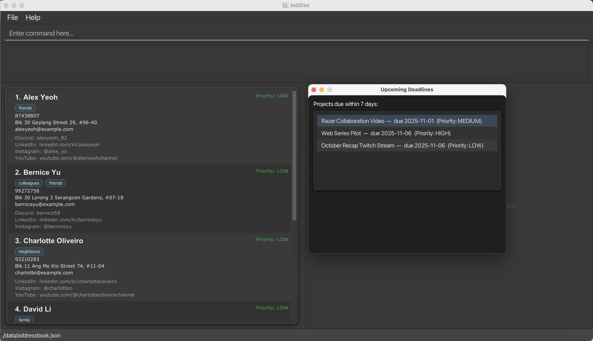
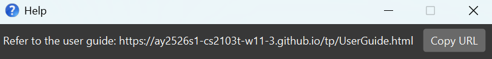
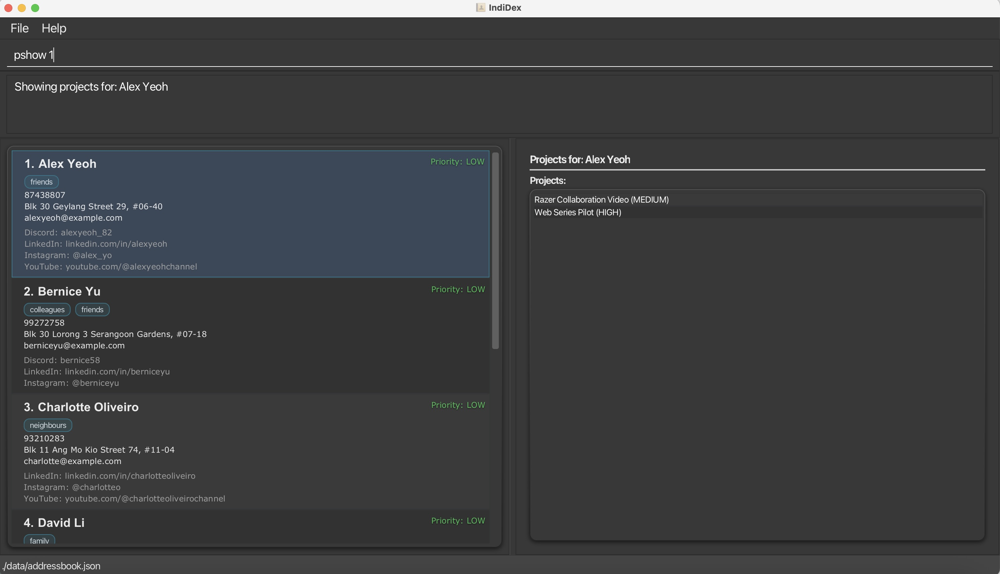
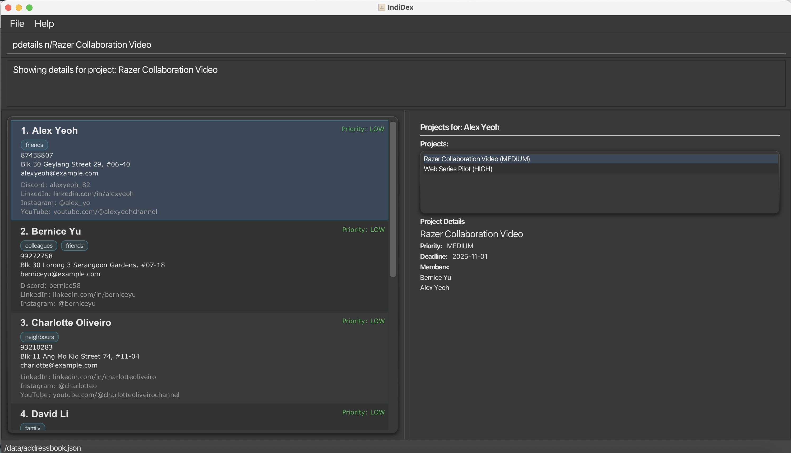
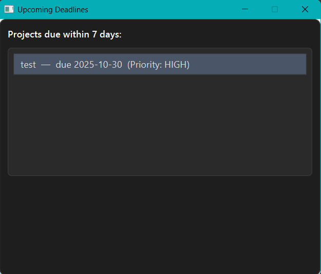

IndiDex is a **desktop contact and project management application designed for indie content creators**, optimised for use via a Command Line Interface (CLI) while still having the benefits of a Graphical User Interface (GUI). If you can type fast, IndiDex can help you manage your content creator network and projects faster than traditional GUI apps. Designed for creators managing 20+ collaborators, IndiDex lets you store all contact details (including social media profiles like Discord, Instagram, YouTube, and LinkedIn), create projects with deadlines, and assign team members—all in seconds rather than minutes.

* Table of Contents
  * [Quick start](#quick-start)
  * [Features](#features)
    * [Contacts](#contacts)
      * [Adding a contact: `add`](#adding-a-contact-add)
      * [Listing all contacts: `list`](#listing-all-contacts--list)
      * [Editing a contact: `edit`](#editing-a-contact--edit)
      * [Finding contacts: `find`](#finding-contacts-find)
      * [Tagging contacts: `tag`](#tagging-contacts-tag)
      * [Deleting contacts: `delete`](#deleting-contacts--delete)
      * [Sorting contacts: `sort`](#sorting-contacts--sort)
    * [Projects](#projects)
      * [Adding a project: `padd`](#adding-a-project-padd)
      * [Editing a project: `pedit`](#editing-a-project-pedit)
      * [Joining a project: `join`](#joining-a-project-join)
      * [Leaving a project: `leave`](#leaving-a-project-leave)
      * [Deleting a project: `pdelete`](#deleting-a-project-pdelete)
      * [Showing projects: `pshow`](#showing-projects-pshow)
      * [Showing project details:
        `pdetails`](#showing-project-details-pdetails)
      * [Showing deadlines: `deadline`](#showing-deadlines-deadline)
    * [Others](#others)
      * [Clearing all entries: `clear`](#clearing-all-entries--clear)
      * [Exiting the program: `exit`](#exiting-the-program--exit)
      * [Saving the data](#saving-the-data)
      * [Editing the data file](#editing-the-data-file)
  * [Field Constraints and
    Validation](#field-constraints-and-validation)
  * [FAQ](#faq)
  * [Known issues](#known-issues)
  * [Command summary](#command-summary)
  * [Glossary](#glossary)

--------------------------------------------------------------------------------------------------------------------

# Quick start

1. Ensure you have Java `17` or above installed in your Computer. 
   **Mac users:** Ensure you have the precise JDK version prescribed [here](https://se-education.org/guides/tutorials/javaInstallationMac.html).

2. Download the latest `.jar` file from [here](https://github.com/AY2526S1-CS2103T-W11-3/tp/releases).

3. Copy the file to the folder you want to use as the _home folder_ for IndiDex.

4. Open a command terminal, `cd` into the folder you put the jar file in, and use the `java -jar IndiDex.jar` command to run the application.
   A GUI similar to the below should appear in a few seconds. Note how the app contains some sample data (the screenshot contains added projects which won't appear on launch). 
   

5. Type the command in the command box and press Enter to execute it. e.g. typing **`help`** and pressing Enter will open the help window. 
   Some example commands you can try:

    * `list` : Lists all contacts.

    * `add n/John Doe p/98765432 e/johnd@example.com a/John street, block 123, #01-01 pr/HIGH dc/johndoe` : Adds a contact named `John Doe` with high priority and Discord handle to IndiDex.

    * `delete 3` : Deletes the 3rd contact shown in the current list.

    * `padd n/Web Series Project d/2025-12-31 pr/HIGH m/1 2 3` : Creates a new project with deadline and assigns the first 3 contacts as team members.

    * `clear` : Deletes all contacts.

    * `exit` : Exits the app.

6. Refer to the [Features](#features) below for details of each command.

--------------------------------------------------------------------------------------------------------------------

# Features

**:information_source: Notes about the command format:** 

* Words in `UPPER_CASE` are the parameters to be supplied by the user. 
  e.g. in `add n/NAME`, `NAME` is a parameter which can be used as `add n/John Doe`.

* Items in square brackets are optional. 
  e.g. `n/NAME [t/TAG]` can be used as `n/John Doe t/friend` or as `n/John Doe`.

* Items with `…`​ after them can be used multiple times including zero times. 
  e.g. `[t/TAG]…​` can be used as ` ` (i.e. 0 times), `t/friend`, `t/friend t/family` etc.

* Parameters can be in any order. 
  e.g. if the command specifies `n/NAME p/PHONE_NUMBER`, `p/PHONE_NUMBER n/NAME` is also acceptable.

* Extraneous parameters for commands that do not take in parameters (such as `help`, `list`, `exit` and `clear`) will be ignored. 
  e.g. if the command specifies `help 123`, it will be interpreted as `help`.

* If you are using a PDF version of this document, be careful when copying and pasting commands that span multiple lines as space characters surrounding line-breaks may be omitted when copied over to the application.

* **INDEX** refers to the index number shown in the displayed contact list. The index **must be a positive integer** 1, 2, 3, …​

### Viewing help : `help`

Shows a message explaining how to access the help page.

Format: `help`

* Additional text after `help` is ignored.

**:information_source: Understanding the IndiDex Interface:**

IndiDex uses a **two-panel layout** to help you manage both contacts and
projects efficiently:

* **Left Panel (Contacts)**: Displays your contact list with all their
  details
    * Shows contact information including name, phone, email, social media
      handles, and tags
    * Use commands like `list`, `find`, `add`, `edit`, and `delete` to manage
      contacts here

* **Right Panel (Projects)**: Displays all project related details
    * Use commands like `padd`, `pdelete`, `pshow`, and `pdetails` to manage
      and view projects here
    * The panel updates automatically when you run project-related commands

**Tip**: The two panels work together - when you use `pshow INDEX`, the app
highlights that selected contact in the left panel. Subsequently, one can do  further project related commands for that index. These commands may then be reflected in the right panel.

## Contacts

### Adding a contact: `add`

Adds a contact to IndiDex.

Format: `add n/NAME p/PHONE e/EMAIL a/ADDRESS [dc/DISCORD_HANDLE] [li/LINKEDIN_PROFILE] [ig/INSTAGRAM_HANDLE] [yt/YOUTUBE_CHANNEL] [pr/PRIORITY] [t/TAG]…​`

* **Required fields:**
    * `n/NAME` - Contact's full name
    * `p/PHONE` - Phone number (minimum 3 digits)
    * `e/EMAIL` - Valid email address
    * `a/ADDRESS` - Physical or mailing address

* **Optional fields:**
    * `pr/PRIORITY` - Priority level: `LOW`, `MEDIUM`, or `HIGH`, defaults to `LOW`
    * `dc/DISCORD_HANDLE` - Discord handle/username
    * `li/LINKEDIN_PROFILE` - LinkedIn profile URL
    * `ig/INSTAGRAM_HANDLE` - Instagram handle
    * `yt/YOUTUBE_CHANNEL` - YouTube channel URL
    * `t/TAG` - Tags for categorizing contacts (can add multiple tags)

Refer to [Field Constraints and Validation](#field-constraints-and-validation) for more details on the acceptable input formats for each parameter.

:bulb: **Tip:**
A contact can have any number of tags (including 0). Social media profiles are optional and will only display if provided.

:exclamation: **Caution:**
IndiDex prevents duplicate contacts. You cannot add a contact with the same name (case-sensitive) as an existing contact.

Examples:
* `add n/John Doe p/98765432 e/johnd@example.com a/John street, block 123, #01-01`
* `add n/Alex Tan p/87654321 e/alex@example.com a/Clementi Ave 2 pr/HIGH dc/alextanyt ig/@alextan yt/youtube.com/@alextanchannel t/animator t/friend`
* `add n/Sarah Lee p/91234567 e/sarah@creator.com a/Bukit Timah Road pr/MEDIUM li/linkedin.com/in/sarahlee t/musician`

### Listing all contacts : `list`

Shows a list of all contacts in IndiDex.

Format: `list`

* Displays all contacts in the address book
* Resets any active search filters applied by the `find` command

### Editing a contact : `edit`

Edits an existing contact in IndiDex.

Format: `edit INDEX [n/NAME] [p/PHONE] [e/EMAIL] [a/ADDRESS] [pr/PRIORITY] [dc/DISCORD_HANDLE] [li/LINKEDIN_PROFILE] [ig/INSTAGRAM_HANDLE] [yt/YOUTUBE_CHANNEL] [t/TAG]…​`

* Edits the contact at the specified `INDEX`.
* At least one of the optional fields must be provided.
* Existing values will be updated to the input values.
* When editing tags, the existing tags of the contact will be removed i.e. adding of tags is not cumulative.
* You can remove all the contact's tags by typing `t/` without specifying any tags after it.
* You can remove existing social media profiles by providing a '-' as input (e.g., `dc/-` to remove Discord handle).

:exclamation: **Caution:**
Editing a contact to have the same details as another existing contact will be rejected to prevent duplicates.

Examples:
* `edit 1 p/91234567 e/johndoe@example.com` - Edits the phone number and email address of the 1st contact
* `edit 2 n/Betsy Crower t/` - Edits the name of the 2nd contact and clears all existing tags
* `edit 3 pr/HIGH dc/newhandle ig/@newinsta` - Updates priority and social media profiles of the 3rd contact

### Finding contacts: `find`

Finds contacts whose details match any of the given keywords.

Format: `find KEYWORD [MORE_KEYWORDS]`

* The search is case-insensitive. e.g. `hans` will match `Hans`
* The order of the keywords does not matter. e.g. `Hans Bo` will match `Bo Hans`
* Searches across **name, phone number, and email address**
* Note that the following fields have different matching criteria:
    * Name has partial matching. E.g. `find Alex` and `find Alex Tan` can both return `Alex Tan`
    * Note that you still have to enter a complete word (e.g. `Alex` instead of `Ale` to search for all names containing `Alex`)
    * You have to enter the entire phone number`find PHONENUM` to search for it
    * Email has partial matching. Either find the entire email e.g. `john@gmail.com` or enter the email domain to find corresponding addresses e.g. `@gmail.com`
* Contacts matching at least one keyword will be returned (i.e. `OR` search).
* To search specifically for email addresses, make sure to always include the `@` symbol in your keyword

Examples:
* `find John` returns `john` and `John Doe`
* `find alex david` returns `Alex Yeoh`, `David Li`
* `find 12349876` returns the specific contact with phone number 12349876
* `find @gmail.com` returns all contacts with Gmail email addresses

### Tagging contacts: `tag`

Adds tags to one or more contacts simultaneously.

Format: `tag INDEX [MORE_INDICES] t/TAG [t/MORE_TAGS]…​`

* Tags the contacts at the specified indices
* Multiple contacts can be tagged in one command
* Multiple tags can be added at once
* Tags are **added to existing tags** (cumulative operation)
* All existing tags are retained

:bulb: **Tip:**
Use the `tag` command to quickly categorize multiple contacts at once instead of editing them individually.

Examples:
* `tag 1 t/client` - Adds the "client" tag to the 1st contact
* `tag 1 2 3 t/collaborator t/2025` - Adds "collaborator" and "2025" tags to contacts 1, 2, and 3
* `tag 5 7 t/urgent` - Adds "urgent" tag to the 5th and 7th contacts

### Deleting contacts : `delete`

Deletes the specified contact(s) from IndiDex.

Format: `delete INDEX [MORE_INDICES]`

* Deletes the contact(s) at the specified index/indices
* Multiple contacts can be deleted in one command
* The index refers to the index number shown in the displayed contact list
* Contacts cannot be deleted if it results in a project having no members left
* Duplicate indices are not allowed (e.g., `delete 1 1` is rejected)

:exclamation: **Caution:**
This operation cannot be undone. Make sure you are deleting the correct contact(s).

Examples:
* `delete 2` deletes the 2nd contact in IndiDex
* `find Betsy` followed by `delete 1` deletes the 1st contact in the results of the `find` command
* `delete 3 5 7` deletes the 3rd, 5th, and 7th contacts in the current displayed list

### Sorting contacts : `sort`

Sort the contact(s) from IndiDex by exactly one chosen attribute.

Format: `sort (n/|p/|a/|pr/|e/)[asc/desc]`

* Sorts the contacts by the specified attribute
* Defaults to ascending order (descending order for priority)
* Alphanumerical attributes are sorted by their Unicode values

Examples:
* `sort n/asc` sorts contacts by name in alphabetical order
* `sort a/` sorts contacts by address in alphabetical order
* `sort pr/` sorts contacts by descending priority (from HIGH to LOW)
* `sort p/desc` sorts contacts by phone numbers in descending numerical order

## Projects

### Adding a project: `padd`

Creates a new project in IndiDex and assigns at least one team member to it.

Format: `padd n/PROJECT_NAME d/DEADLINE pr/PRIORITY m/MEMBER_INDEX [m/MEMBER_INDEX]…​`
* **Required fields:**
    * `n/PROJECT_NAME` - Name of the project (case-insensitive) and restricted to 35 characters
    * `d/DEADLINE` - Project deadline in `yyyy-MM-dd` format (e.g., 2025-12-31; cannot be in the past)
    * `pr/PRIORITY` - Priority level: `LOW`, `MEDIUM`, or `HIGH`
    *  `m/MEMBER_INDEX` – At least one member index (you can add multiple)

:bulb: **Tip:**
You can view all your projects in the project panel on the right side of the application.

:exclamation: **Caution:** Project names are **case-insensitive** for uniqueness. **Duplicate member indices are rejected** (e.g., `m/1 1`). Member indices must refer to contacts in the **currently displayed list**.

Examples:
* `padd n/Web Series Pilot d/2025-11-30 pr/HIGH m/1` - Creates a high priority project with deadline and assigns contact 1
* `padd n/Animation Collab d/2025-12-31 pr/MEDIUM m/1 2 3` - Creates a project and assigns contacts 1, 2, and 3 as members
* `padd n/Podcast Season 2 d/2026-09-15 pr/LOW m/5` - Creates a low priority project with one team member

### Editing a project: `pedit`

Edits the details of the chosen project.

Format: `pedit OLD_PROJECT_NAME [n/NEW_PROJECT_NAME] [d/DEADLINE] [pr/PRIORITY]​`

* At least one of the optional fields must be specified
* Project name cannot be changed to that of another project (**case-insensitive**)
* Project deadline cannot be changed to a past date
* Member editing is handled using the leave and join commands instead

Examples:
* `pedit Web Series n/Web Series Pilot` -  Changes the name of the project to 'Web Series Pilot'
* `pedit Razer Video d/2025-11-11 pr/high` - Moves the deadline of the project and changes its priority to high

### Joining a project: `join`

Adds the specified members to the chosen project.

Format: `join n/PROJECT_NAME m/MEMBER_INDEX [m/MEMBER_INDEX]...`

* Adds the contacts at the specified indices to the named project
* Specifying projects is **case-insensitive**
* Adding existing members has no effect but are allowed only if there is at least one new member joining

Examples:
* `join n/Shopee Advertisement m/3` - Adds the third contact in the list to the project 'Shopee Advertisement'
* `join m/6 m/7 n/soc vlog` - Adds the sixth and seventh contact in the list to the project 'SoC Vlog'

### Leaving a project: `leave`

Removes the specified members to the chosen project.

Format: `leave n/PROJECT_NAME m/MEMBER_INDEX [m/MEMBER_INDEX]...`

* Removes the contacts at the specified indices to the named project
* Specifying projects is **case-insensitive**
* Contacts who are not members are not allowed to leave
* Contacts are not allowed to leave if there will be no member remaining in the project

Examples
* `leave n/Shopee Advertisement m/2` - Removes the second contact from the project if they are a member
* `leave m/5 m/6 n/soc vlog` - Removes the fifth and sixth contact from the project

### Deleting a project: `pdelete`

Removes a project from IndiDex.

Format: `pdelete n/PROJECT_NAME`

* Deletes the project whose name matches exactly (case-insensitive)
* Provide exactly one `n/PROJECT_NAME`
* Operates on the currently displayed project list

:exclamation: **Caution:**  
This action cannot be undone. Ensure the project is visible in the project panel and the name matches exactly, ignoring case.  

Examples:
* `pdelete n/Web Series Pilot` - Deletes the project named “Web Series Pilot”
* `pdelete n/Animation Collab` - Also deletes “Animation Collab” (matching is case-insensitive)

### Showing projects: `pshow`

Displays projects in the project panel.

Format: `pshow INDEX` or `pshow all`

* **With INDEX**: Shows projects for the contact at the specified index
    * The index refers to the index number shown in the displayed contact list
    * The index **must be a positive integer** 1, 2, 3, …​
    * Highlights the contact in the person panel. 
    * If the selected person belongs to only 1 project, that project is highlighted as well

* **With `pshow all`**: Displays all projects in the project panel
    * Resets any previous contact-specific project filtering

:bulb: **Tip:**
Use `pshow INDEX` to quickly find which projects a specific contact is
involved in. Use `pshow all` to get an overview of all your projects.

Examples:
* `pshow 1` - Shows all projects that the 1st contact is a member of
* `pshow all` - Shows all projects in IndiDex
* `find John` followed by `pshow 1` - Shows projects belonging to the 1st person in
  the search results (if there is at least one person found after the search)

### Showing project details: `pdetails`

Displays detailed information for a specific project by its exact name.

Format: `pdetails n/PROJECT_NAME`

* **Required field:**
    * `n/PROJECT_NAME` - The name of the project (case-insensitive)

* Displays the project's deadline, priority, and team members in the project
  panel
* Note that executing `pdetails n/PROJECT_NAME`:
  * After executing `pshow all` will show project details under the list of all projects rendered using `pshow all`.
  * After executing `pshow INDEX` will show project details under the selected person's (using `pshow`) project list
    if and only if the project belongs to that selected member. Project details would be shown standalone 
    otherwise if the project doesn't belong to the selected member.
  * Without executing any `pshow` command prior will show project details only.

Examples:
* `pdetails n/Web Series Pilot` - Shows detailed information for the "Web
  Series Pilot" project
* `pdetails n/Animation Collab` - Shows details for the "Animation Collab"
  project

### Showing deadlines: `deadline`

Shows projects that have deadlines less than 7 days from now.

Format: `deadline`

* Additional text after `deadline` is ignored.

## Others

### Clearing all entries : `clear`

Clears all entries (both persons and projects) from IndiDex.

Format: `clear`

:exclamation: **Caution:**
This will delete ALL contacts and projects. This operation cannot be undone. Make sure to back up your data before using this command.

### Exiting the program : `exit`

Exits the program.

Format: `exit`

### Saving the data

IndiDex data are saved in the hard disk automatically after any command that changes the data. There is no need to save manually.

### Editing the data file

IndiDex data are saved automatically as a JSON file `[JAR file location]/data/addressbook.json`. Advanced users are welcome to update data directly by editing that data file.

:exclamation: **Caution:**
If your changes to the data file makes its format invalid, IndiDex will discard all data and start with an empty data file at the next run. Hence, it is recommended to take a backup of the file before editing it. 
Furthermore, certain edits can cause IndiDex to behave in unexpected ways (e.g., if a value entered is outside the acceptable range). Therefore, edit the data file only if you are confident that you can update it correctly.

--------------------------------------------------------------------------------------------------------------------

## Field Constraints and Validation

### Name
* Can contain only contain alphanumeric characters and spaces.
* Cannot be blank

### Phone Number
* Must contain at least 3 digits
* Only numeric characters are allowed
* No spaces or special characters

### Email Address
* Must follow the format: `local-part@domain`
* **Local part** (before @):
    * May contain alphanumeric characters and these special characters: `+` `_` `.` `-`
    * Cannot start or end with special characters
* **Domain** (after @):
    * Must consist of domain labels separated by periods
    * Each domain label must:
        * Start and end with alphanumeric characters
        * Consist of alphanumeric characters and hyphens only
    * Last domain label must be at least 2 characters long

### Address
* Can contain any characters
* Cannot be blank

### Priority
* Must be one of: `LOW`, `MEDIUM`, or `HIGH`
* Not case-sensitive (can be lowercase or uppercase)

### Social Media Profiles
* All social media fields are **optional**.  
* Empty fields will simply not be displayed.
* **Note:** The application does not check for duplicate social media handles across different persons, as users may legitimately share handles for group, community, or institutional accounts. Enforcing uniqueness could unnecessarily restrict valid entries.

**Discord**
* Must be **2–32 characters long**
* Can only contain **lowercase letters**, **digits**, **periods (.)**, or **underscores (_)**
* Cannot **start or end** with a period or underscore
* Cannot have **consecutive periods or underscores**
* **Examples:**
    * ✅ `john_doe`
    * ❌ `_johndoe` (starts with underscore)
    * ❌ `john..doe` (consecutive periods)

**Instagram**
* Must **start with '@'** followed by **1–30 characters**
* Can contain **letters**, **numbers**, **underscores (_)**, or **periods (.)**
* Cannot **start or end** with a period
* Cannot have **consecutive periods**
* **Examples:**
    * ✅ `@john.doe_23`
    * ❌ `@.johndoe` (starts with period)
    * ❌ `@john..doe` (consecutive periods)

**LinkedIn**
* Must be a **valid LinkedIn profile URL** that starts with  
  `'https://www.linkedin.com/in/'`, `'www.linkedin.com/in/'` or `'linkedin.com/in/'`
* Must be followed by your **profile identifier** (letters, digits, hyphens, or underscores)
* **Examples:**
    * ✅ `https://www.linkedin.com/in/john-doe`
    * ❌ `linkedin.com/johndoe` (missing `/in/` segment)

**YouTube**
* Must be a **valid YouTube URL** or **handle**, starting with `https://www.youtube.com/`, `www.youtube.com/` or `youtube.com/`  

Supported formats:
- `youtube.com/@handle`
    * Handle must be **3–30 characters long**
    * Can include **letters**, **digits**, **underscores (_)**, **hyphens (-)**, or **periods (.)**
    * Cannot **start or end** with an underscore or hyphen

- `youtube.com/channel/UCxxxxxxxxxxxxxxxxxxxxxx`
    * Must start with `UC` and be **24 characters long**
    * Remaining 22 characters may include **letters**, **digits**, **underscores**, or **hyphens**

- `youtube.com/c/customName`
    * Can include **letters**, **digits**, **underscores**, or **hyphens**
    * Cannot **start or end** with an underscore or hyphen

- `youtube.com/user/username`
    * Can include **letters**, **digits**, **underscores**, or **hyphens**

  **Examples:**
    * ✅ `https://www.youtube.com/@john_doe`
    * ✅ `https://www.youtube.com/channel/UCabcdef1234567890ghijkl`
    * ✅ `https://www.youtube.com/c/JohnTech`
    * ✅ `https://www.youtube.com/user/johntech`
    * ❌ `https://www.youtube.com/@_john` (starts with underscore)

### Tags
* Alphanumeric characters only (no spaces or special characters)
* No longer than 35 characters
* Each tag is displayed as a separate label
* Tags are automatically sorted alphabetically on display

### Project Deadline
* Must be in `yyyy-MM-dd` format
* Examples: `2025-12-31`, `2025-06-15`, `2025-01-01`
* Cannot be created with or edited to have a past date

--------------------------------------------------------------------------------------------------------------------

## FAQ

**Q**: How do I transfer my data to another computer? 
**A**: Install the app in the other computer and overwrite the empty data file it creates with the file that contains the data of your previous IndiDex home folder.

**Q**: Can I add the same person twice to IndiDex? 
**A**: No, IndiDex prevents duplicate contacts. If a duplicate contact with an exact same name already entered is entered again, you will receive an error message.

**Q**: What happens to contacts when I delete a project they're assigned to? 
**A**: The contacts remain in IndiDex. Only the project is removed. The project links on the contact cards will be removed.

**Q**: Can I assign contacts to a project after creating it? 
**A**: Currently, you need to specify project members when creating the project using the `padd` command. Future versions may support adding members to existing projects.

**Q**: How do I remove a tag from a contact? 
**A**: Use the `edit` command and specify only the tags you want to keep. For example, `edit 1 t/keepThisTag` will remove all other tags and keep only "keepThisTag". To remove all tags, use `edit 1 t/`.

**Q**: Are social media profiles mandatory? 
**A**: No, all social media profiles (Discord, LinkedIn, Instagram, YouTube) are optional. Only Name, Phone, Email, and Address are required when adding a contact.

**Q**: What's the difference between `tag` and `edit` for adding tags? 
**A**: The `tag` command **adds** tags to existing tags (cumulative), while `edit` **replaces** all existing tags with the new ones specified.

--------------------------------------------------------------------------------------------------------------------

## Known issues

1. **When using multiple screens**, if you move the application to a secondary screen, and later switch to using only the primary screen, the GUI will open off-screen. The remedy is to delete the `preferences.json` file created by the application before running the application again.
3. **If you minimize the Help Window** and then run the `help` command (or use the `Help` menu, or the keyboard shortcut `F1`) again, the original Help Window will remain minimized, and no new Help Window will appear. The remedy is to manually restore the minimized Help Window.

--------------------------------------------------------------------------------------------------------------------

## Command summary

| Action                   | Format, Examples                                                                                                                                                                                                                                             |
|--------------------------|--------------------------------------------------------------------------------------------------------------------------------------------------------------------------------------------------------------------------------------------------------------|
| **Add Contact**          | `add n/NAME p/PHONE e/EMAIL a/ADDRESS [pr/PRIORITY] [dc/DISCORD_HANDLE] [li/LINKEDIN_PROFILE] [ig/INSTAGRAM_HANDLE] [yt/YOUTUBE_CHANNEL] [t/TAG]…​`   e.g., `add n/James Ho p/22224444 e/jamesho@example.com a/123 Clementi Rd pr/HIGH dc/jamesho t/friend` |
| **List**                 | `list`                                                                                                                                                                                                                                                       |
| **Edit**                 | `edit INDEX [n/NAME] [p/PHONE] [e/EMAIL] [a/ADDRESS] [pr/PRIORITY] [dc/DISCORD_HANDLE] [li/LINKEDIN_PROFILE] [ig/INSTAGRAM_HANDLE] [yt/YOUTUBE_CHANNEL] [t/TAG]…​`  e.g., `edit 2 n/James Lee e/jameslee@example.com pr/MEDIUM`                           |
| **Find**                 | `find KEYWORD [MORE_KEYWORDS]`  e.g., `find James Jake`, `find @gmail.com`                                                                                                                                                                                |
| **Tag**                  | `tag INDEX [MORE_INDICES] t/TAG [t/MORE_TAGS]…​`  e.g., `tag 1 2 3 t/collaborator t/urgent`                                                                                                                                                               |
| **Delete**               | `delete INDEX [MORE_INDICES]`  e.g., `delete 3`, `delete 1 3 5`                                                                                                                                                                                           |
| **Sort**                 | `sort (n/\|p/\|e/\|pr/\|a/)[asc/desc] ​`  e.g., `sort p/desc`, `sort pr/`                                                                                                                                                                                 |
| **Add Project**          | `padd n/PROJECT_NAME d/DEADLINE pr/PRIORITY m/MEMBER_INDEX [m/MEMBER_INDEX]…`   e.g., `padd n/Web Series d/2025-12-31 pr/HIGH m/1 2 3`                                                                                                                    |
| **Edit Project**         | `pedit OLD_PROJECT_NAME [n/NEW_PROJECT_NAME] [d/DEADLINE] [pr/PRIORITY]​`  e.g., `pedit Web Series n/Web Series Season 1 d/2025-12-15 pr/MEDIUM`                                                                                                          |
| **Join Project**         | `join n/PROJECT NAME m/MEMBER_INDEX [m/MEMBER_INDEX]...`   e.g. `join n/Web Series m/1 m/2`                                                                                                                                                               |
| **Leave Project**        | `leave n/PROJECT NAME m/MEMBER_INDEX [m/MEMBER_INDEX]...`   e.g. `leave n/Web Series m/3 m/4`                                                                                                                                                             |
| **Delete Project**       | `pdelete n/PROJECT_NAME`  e.g., `pdelete Web Series Pilot`                                                                                                                                                                                                |
| **Show Projects**        | `pshow all` or `pshow INDEX`   e.g., `pshow 1`                                                                                                                                                                                                            |
| **Show Project Details** | `pdetails n/PROJECT_NAME`  e.g., `pdetails n/Web Series Pilot`                                                                                                                                                                                            |
| **Show Deadlines**       | `deadline`                                                                                                                                                                                                                                                   |
| **Clear**                | `clear`                                                                                                                                                                                                                                                      |
| **Help**                 | `help`                                                                                                                                                                                                                                                       |
| **Exit**                 | `exit`                                                                                                                                                                                                                                                       |

--------------------------------------------------------------------------------------------------------------------

## Glossary

* **CLI (Command Line Interface)**: A text-based interface where users type commands to interact with the application
* **GUI (Graphical User Interface)**: A visual interface with windows, buttons, and other graphical elements
* **Index**: The position number of a contact in the displayed list (starts from 1)
* **Parameter**: Information you provide in a command (e.g., name, phone number)
* **Tag**: A label used to categorize contacts (e.g., "friend", "colleague", "urgent")
* **Priority**: A classification of importance (LOW, MEDIUM, or HIGH) for contacts or projects
* **Project**: A collection of information about a collaborative effort, including deadline, priority, and team members
* **JSON**: A file format used to store IndiDex data
* **Indie Content Creator**: A self-employed person who creates digital content like videos, podcasts, music, or animations and shares it online. "Indie" (short for independent) means they work for themselves rather than for a company, and they often collaborate with other freelancers to produce their content. Examples include independent YouTubers, podcasters, Twitch streamers, and digital artists.

--------------------------------------------------------------------------------------------------------------------
