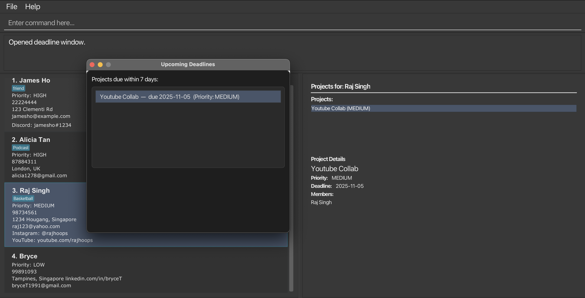

* This is **an application to help indie content creators to manage their contacts efficiently**. 
  Example usages:
    * Adding clients' contacts
    * Tracking upcoming project deadlines
* The project simulates an ongoing software project for a desktop application (called _Indidex_) used for managing contact details.
    * It is **written in OOP fashion** and follows good software engineering practices.
    * It comes with a **reasonable level of user and developer documentation**.
* It is named `IndiDex` because it is an index-based address book for indie developers.
* For the detailed documentation of this project, see the **[IndiDex User Guide](https://ay2526s1-cs2103t-w11-3.github.io/tp/UserGuide.html)**.
* This project is based on the AddressBook-Level3 project created by the [SE-EDU initiative](https://se-education.org).

**Acknowledgements**

* Libraries used: [JavaFX](https://openjfx.io/), [Jackson](https://github.com/FasterXML/jackson), [JUnit5](https://github.com/junit-team/junit5)
